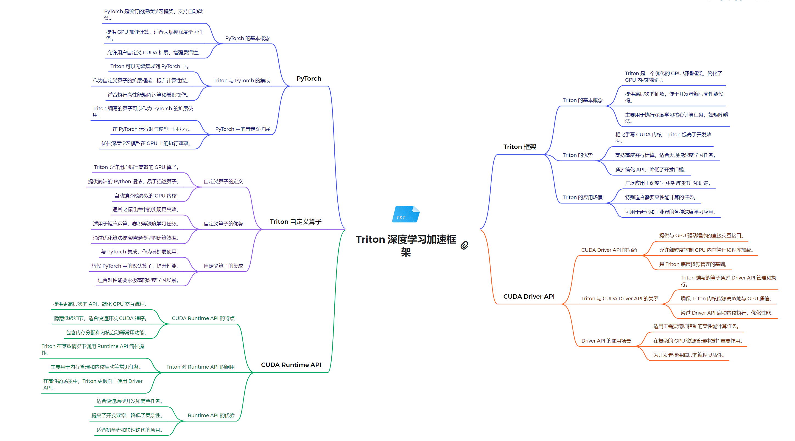

# 技术栈架构
1. **系统软件层**
   - **NVIDIA GPU 驱动**：为 GPU 提供基本的系统级支持。
   - **CUDA Driver API**：低级 API，提供对 GPU 的直接控制。
     - 允许直接管理设备、内存分配和程序执行。
     - 适用于需要细粒度控制的高级应用。
     - 提供与 NVIDIA GPU 硬件交互的底层接口。

2. **运行时环境层**
   - **CUDA Runtime API**：高级 API，简化了 GPU 编程，自动管理许多底层细节。
     - 提供更高级的抽象，简化了 GPU 的使用。
     - 自动处理上下文管理和程序加载等任务。
     - 更适合一般开发者使用，提供了更好的易用性。

3. **编程模型和语言层**
   - **Triton DSL (领域特定语言)**：扩展了 Python，允许开发者编写在 GPU 上运行的并行程序。
     - 允许在 CPU 和 GPU 上混合编程。
     - 使用 Triton 特定语法定义 GPU 函数。
     - 通过方言（Dialect）提供优化的操作和功能。

4. **计算库层**
   - **Triton 实现的算子库**：提供高性能的计算内核，专门针对各种深度学习操作进行优化。
     - 针对特定操作的高效实现，如矩阵运算。

5. **框架层**
   - **PyTorch**：支持动态计算图的深度学习框架，通过 `torch.cuda` 模块提供 CUDA 功能。
     - 自动管理 GPU 内存，支持 GPU 和 CPU 之间的数据转移。
   - **TensorFlow**：支持静态和动态计算图的深度学习框架。
     - 通过 XLA 编译器优化 GPU 代码执行，提供高级 API 来简化 CUDA API 的使用。

##### 关系解析
