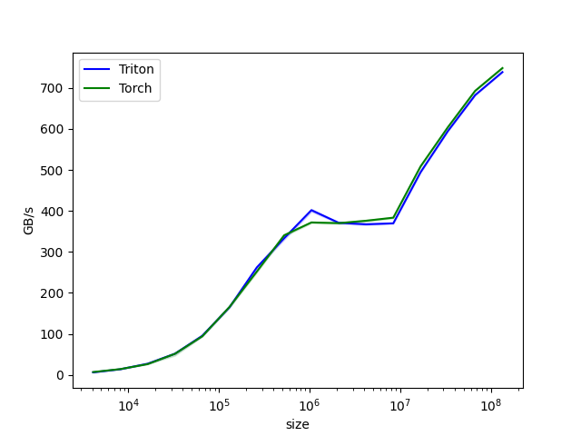
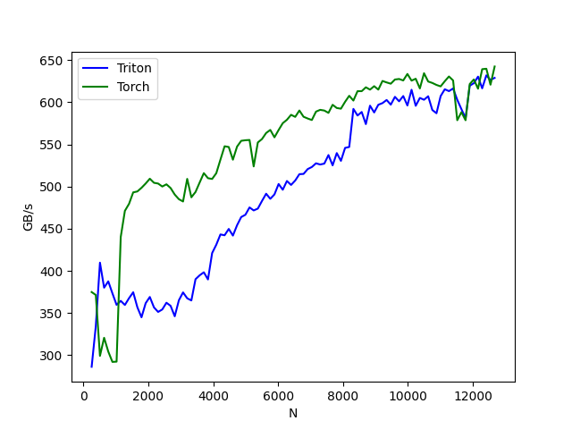

# 计算库层（同chapter3.4 5）

Triton 提供了高性能的计算库，开发者可以利用这些库进行高效操作。例如，标准的Add（向量加法）、 GEMM（矩阵乘法）等操作可以使用 Triton 的编程模型实现，利用自定义内存访问模式和自动调优功能获得更佳性能。

参考仓库地址：[triton](https://github.com/triton-lang/triton)

向量加法的实现示例代码如下：

```python
"""
Vector Addition
===============

In this tutorial, you will write a simple vector addition using Triton.

In doing so, you will learn about:

* The basic programming model of Triton.

* The `triton.jit` decorator, which is used to define Triton kernels.

* The best practices for validating and benchmarking your custom ops against native reference implementations.

"""

# %%
# Compute Kernel
# --------------

import torch

import triton
import triton.language as tl

@triton.jit
def add_kernel(x_ptr,  # *Pointer* to first input vector.
               y_ptr,  # *Pointer* to second input vector.
               output_ptr,  # *Pointer* to output vector.
               n_elements,  # Size of the vector.
               BLOCK_SIZE: tl.constexpr,  # Number of elements each program should process.
               # NOTE: `constexpr` so it can be used as a shape value.
               ):
    # There are multiple 'programs' processing different data. We identify which program
    # we are here:
    pid = tl.program_id(axis=0)  # We use a 1D launch grid so axis is 0.
    # This program will process inputs that are offset from the initial data.
    # For instance, if you had a vector of length 256 and block_size of 64, the programs
    # would each access the elements [0:64, 64:128, 128:192, 192:256].
    # Note that offsets is a list of pointers:
    block_start = pid * BLOCK_SIZE
    offsets = block_start + tl.arange(0, BLOCK_SIZE)
    # Create a mask to guard memory operations against out-of-bounds accesses.
    mask = offsets < n_elements
    # Load x and y from DRAM, masking out any extra elements in case the input is not a
    # multiple of the block size.
    x = tl.load(x_ptr + offsets, mask=mask)
    y = tl.load(y_ptr + offsets, mask=mask)
    output = x + y
    # Write x + y back to DRAM.
    tl.store(output_ptr + offsets, output, mask=mask)

# %%
# Let's also declare a helper function to (1) allocate the `z` tensor
# and (2) enqueue the above kernel with appropriate grid/block sizes:

def add(x: torch.Tensor, y: torch.Tensor):
    # We need to preallocate the output.
    output = torch.empty_like(x)
    assert x.is_cuda and y.is_cuda and output.is_cuda
    n_elements = output.numel()
    # The SPMD launch grid denotes the number of kernel instances that run in parallel.
    # It is analogous to CUDA launch grids. It can be either Tuple[int], or Callable(metaparameters) -> Tuple[int].
    # In this case, we use a 1D grid where the size is the number of blocks:
    grid = lambda meta: (triton.cdiv(n_elements, meta['BLOCK_SIZE']), )
    # NOTE:
    #  - Each torch.tensor object is implicitly converted into a pointer to its first element.
    #  - `triton.jit`'ed functions can be indexed with a launch grid to obtain a callable GPU kernel.
    #  - Don't forget to pass meta-parameters as keywords arguments.
    add_kernel[grid](x, y, output, n_elements, BLOCK_SIZE=1024)
    # We return a handle to z but, since `torch.cuda.synchronize()` hasn't been called, the kernel is still
    # running asynchronously at this point.
    return output

# %%
# We can now use the above function to compute the element-wise sum of two `torch.tensor` objects and test its correctness:

torch.manual_seed(0)
size = 98432
x = torch.rand(size, device='cuda')
y = torch.rand(size, device='cuda')
output_torch = x + y
output_triton = add(x, y)
print(output_torch)
print(output_triton)
print(f'The maximum difference between torch and triton is '
      f'{torch.max(torch.abs(output_torch - output_triton))}')

# %%
# Seems like we're good to go!

# %%
# Benchmark
# ---------
#
# We can now benchmark our custom op on vectors of increasing sizes to get a sense of how it does relative to PyTorch.
# To make things easier, Triton has a set of built-in utilities that allow us to concisely plot the performance of our custom ops.
# for different problem sizes.


@triton.testing.perf_report(
    triton.testing.Benchmark(
        x_names=['size'],  # Argument names to use as an x-axis for the plot.
        x_vals=[2**i for i in range(12, 28, 1)],  # Different possible values for `x_name`.
        x_log=True,  # x axis is logarithmic.
        line_arg='provider',  # Argument name whose value corresponds to a different line in the plot.
        line_vals=['triton', 'torch'],  # Possible values for `line_arg`.
        line_names=['Triton', 'Torch'],  # Label name for the lines.
        styles=[('blue', '-'), ('green', '-')],  # Line styles.
        ylabel='GB/s',  # Label name for the y-axis.
        plot_name='vector-add-performance',  # Name for the plot. Used also as a file name for saving the plot.
        args={},  # Values for function arguments not in `x_names` and `y_name`.
    ))
def benchmark(size, provider):
    x = torch.rand(size, device='cuda', dtype=torch.float32)
    y = torch.rand(size, device='cuda', dtype=torch.float32)
    quantiles = [0.5, 0.2, 0.8]
    if provider == 'torch':
        ms, min_ms, max_ms = triton.testing.do_bench(lambda: x + y, quantiles=quantiles)
    if provider == 'triton':
        ms, min_ms, max_ms = triton.testing.do_bench(lambda: add(x, y), quantiles=quantiles)
    gbps = lambda ms: 3 * x.numel() * x.element_size() / ms * 1e-6
    return gbps(ms), gbps(max_ms), gbps(min_ms)

# %%
# We can now run the decorated function above. Pass `print_data=True` to see the performance number, `show_plots=True` to plot them, and/or
# `save_path='/path/to/results/' to save them to disk along with raw CSV data:
benchmark.run(print_data=True, show_plots=True, save_path="output")

```

结果：

```
tensor([1.3713, 1.3076, 0.4940,  ..., 0.9584, 0.7074, 1.3011], device='cuda:0')
tensor([1.3713, 1.3076, 0.4940,  ..., 0.9584, 0.7074, 1.3011], device='cuda:0')
The maximum difference between torch and triton is 0.0
vector-add-performance:
           size      Triton       Torch
0        4096.0    6.237563    6.942373
1        8192.0   13.806741   14.124138
2       16384.0   27.306667   26.284491
3       32768.0   51.738946   51.468063
4       65536.0   95.440773   94.070810
5      131072.0  165.216809  165.913932
6      262144.0  262.143998  252.061538
7      524288.0  333.233892  340.446769
8     1048576.0  401.753280  371.835454
9     2097152.0  370.953018  370.085627
10    4194304.0  367.274371  375.945969
11    8388608.0  369.649426  383.447069
12   16777216.0  494.318016  508.501939
13   33554432.0  594.617812  604.037490
14   67108864.0  682.344488  692.781332
15  134217728.0  738.572773  748.332490
```


下面将实现一个融合的 softmax 操作，该操作在处理特定类型的矩阵时，性能显著优于 PyTorch 的原生实现。具体而言，当矩阵的行可以适应 GPU 的 SRAM 时，融合内核可以减少内存访问并提高计算效率。通过这个例子，我们将学习内核融合的好处以及 Triton 中的归约操作。

融合的 softmax实现示例代码如下：

```python
"""
Fused Softmax
=============

In this tutorial, you will write a fused softmax operation that is significantly faster
than PyTorch's native op for a particular class of matrices: those whose rows can fit in
the GPU's SRAM.

In doing so, you will learn about:

* The benefits of kernel fusion for bandwidth-bound operations.

* Reduction operators in Triton.

"""

# %%
# Motivations
# -----------
#
# Custom GPU kernels for elementwise additions are educationally valuable but won't get you very far in practice.
# Let us consider instead the case of a simple (numerically stabilized) softmax operation:

import torch

import triton
import triton.language as tl
from triton.runtime import driver

def is_hip():
    return triton.runtime.driver.active.get_current_target().backend == "hip"

def is_cdna():
    return is_hip() and triton.runtime.driver.active.get_current_target().arch in ('gfx940', 'gfx941', 'gfx942',
                                                                                   'gfx90a', 'gfx908')

def naive_softmax(x):
    """Compute row-wise softmax of X using native pytorch

    We subtract the maximum element in order to avoid overflows. Softmax is invariant to
    this shift.
    """
    # read  MN elements ; write M  elements
    x_max = x.max(dim=1)[0]
    # read MN + M elements ; write MN elements
    z = x - x_max[:, None]
    # read  MN elements ; write MN elements
    numerator = torch.exp(z)
    # read  MN elements ; write M  elements
    denominator = numerator.sum(dim=1)
    # read MN + M elements ; write MN elements
    ret = numerator / denominator[:, None]
    # in total: read 5MN + 2M elements ; wrote 3MN + 2M elements
    return ret

# %%
# When implemented naively in PyTorch, computing :code:`y = naive_softmax(x)` for :math:`x \in R^{M \times N}`
# requires reading :math:`5MN + 2M` elements from DRAM and writing back :math:`3MN + 2M` elements.
# This is obviously wasteful; we'd prefer to have a custom "fused" kernel that only reads
# X once and does all the necessary computations on-chip.
# Doing so would require reading and writing back only :math:`MN` bytes, so we could
# expect a theoretical speed-up of ~4x (i.e., :math:`(8MN + 4M) / 2MN`).
# The `torch.jit.script` flags aims to perform this kind of "kernel fusion" automatically
# but, as we will see later, it is still far from ideal.

# %%
# Compute Kernel
# --------------
#
# Our softmax kernel works as follows: each program loads a set of rows of the input matrix X strided by number of programs,
# normalizes it and writes back the result to the output Y.
#
# Note that one important limitation of Triton is that each block must have a
# power-of-two number of elements, so we need to internally "pad" each row and guard the
# memory operations properly if we want to handle any possible input shapes:


@triton.jit
def softmax_kernel(output_ptr, input_ptr, input_row_stride, output_row_stride, n_rows, n_cols, BLOCK_SIZE: tl.constexpr,
                   num_stages: tl.constexpr):
    # starting row of the program
    row_start = tl.program_id(0)
    row_step = tl.num_programs(0)
    for row_idx in tl.range(row_start, n_rows, row_step, num_stages=num_stages):
        # The stride represents how much we need to increase the pointer to advance 1 row
        row_start_ptr = input_ptr + row_idx * input_row_stride
        # The block size is the next power of two greater than n_cols, so we can fit each
        # row in a single block
        col_offsets = tl.arange(0, BLOCK_SIZE)
        input_ptrs = row_start_ptr + col_offsets
        # Load the row into SRAM, using a mask since BLOCK_SIZE may be > than n_cols
        mask = col_offsets < n_cols
        row = tl.load(input_ptrs, mask=mask, other=-float('inf'))
        # Subtract maximum for numerical stability
        row_minus_max = row - tl.max(row, axis=0)
        # Note that exponentiation in Triton is fast but approximate (i.e., think __expf in CUDA)
        numerator = tl.exp(row_minus_max)
        denominator = tl.sum(numerator, axis=0)
        softmax_output = numerator / denominator
        # Write back output to DRAM
        output_row_start_ptr = output_ptr + row_idx * output_row_stride
        output_ptrs = output_row_start_ptr + col_offsets
        tl.store(output_ptrs, softmax_output, mask=mask)

# %%
# We can create a helper function that enqueues the kernel and its (meta-)arguments for any given input tensor.

device = torch.cuda.current_device()
properties = driver.active.utils.get_device_properties(device)
NUM_SM = properties["multiprocessor_count"]
NUM_REGS = properties["max_num_regs"]
SIZE_SMEM = properties["max_shared_mem"]
WARP_SIZE = properties["warpSize"]
target = triton.runtime.driver.active.get_current_target()
kernels = {}


def softmax(x):
    n_rows, n_cols = x.shape

    # The block size of each loop iteration is the smallest power of two greater than the number of columns in `x`
    BLOCK_SIZE = triton.next_power_of_2(n_cols)

    # Another trick we can use is to ask the compiler to use more threads per row by
    # increasing the number of warps (`num_warps`) over which each row is distributed.
    # You will see in the next tutorial how to auto-tune this value in a more natural
    # way so you don't have to come up with manual heuristics yourself.
    num_warps = 8

    # Number of software piepling stages.
    num_stages = 4 if SIZE_SMEM > 200000 else 2

    # Allocate output
    y = torch.empty_like(x)

    # pre-compile kernel to get register usage and compute thread occupancy.
    kernel, num_programs = kernels.get(BLOCK_SIZE, (None, 0))
    if kernel is None:
        kernel = softmax_kernel.warmup(y, x, x.stride(0), y.stride(0), n_rows, n_cols, BLOCK_SIZE=BLOCK_SIZE,
                                       num_stages=num_stages, num_warps=num_warps, grid=(1, ))
        kernel._init_handles()
        n_regs = kernel.n_regs
        size_smem = kernel.metadata.shared
        if is_hip():
            # NUM_REGS represents the number of regular purpose registers. On CDNA architectures this is half of all registers available.
            # However, this is not always the case. In most cases all registers can be used as regular purpose registers.
            # ISA SECTION (3.6.4 for CDNA3)
            # VGPRs are allocated out of two pools: regular VGPRs and accumulation VGPRs. Accumulation VGPRs are used
            # with matrix VALU instructions, and can also be loaded directly from memory. A wave may have up to 512 total
            # VGPRs, 256 of each type. When a wave has fewer than 512 total VGPRs, the number of each type is flexible - it is
            # not required to be equal numbers of both types.
            if is_cdna():
                NUM_GPRS = NUM_REGS * 2

            # MAX_NUM_THREADS represents maximum number of resident threads per multi-processor.
            # When we divide this number with WARP_SIZE we get maximum number of waves that can
            # execute on a CU (multi-processor)  in parallel.
            MAX_NUM_THREADS = properties["max_threads_per_sm"]
            max_num_waves = MAX_NUM_THREADS // WARP_SIZE
            occupancy = min(NUM_GPRS // WARP_SIZE // n_regs, max_num_waves) // num_warps
        else:
            occupancy = NUM_REGS // (n_regs * WARP_SIZE * num_warps)
        occupancy = min(occupancy, SIZE_SMEM // size_smem)
        num_programs = NUM_SM * occupancy
        kernels[BLOCK_SIZE] = (kernel, num_programs)

    num_programs = min(num_programs, n_rows)

    # Create a number of persistent programs.
    kernel[(num_programs, 1, 1)](
        y,
        x,
        x.stride(0),
        y.stride(0),
        n_rows,
        n_cols,
    )
    return y

# %%
# Unit Test
# ---------

# %%
# We make sure that we test our kernel on a matrix with an irregular number of rows and columns.
# This will allow us to verify that our padding mechanism works.

torch.manual_seed(0)
x = torch.randn(1823, 781, device='cuda')
y_triton = softmax(x)
y_torch = torch.softmax(x, axis=1)
assert torch.allclose(y_triton, y_torch), (y_triton, y_torch)

# %%
# As expected, the results are identical.

# %%
# Benchmark
# ---------
#
# Here we will benchmark our operation as a function of the number of columns in the input matrix -- assuming 4096 rows.
# We will then compare its performance against (1) :code:`torch.softmax` and (2) the :code:`naive_softmax` defined above.


@triton.testing.perf_report(
    triton.testing.Benchmark(
        x_names=['N'],  # argument names to use as an x-axis for the plot
        x_vals=[128 * i for i in range(2, 100)],  # different possible values for `x_name`
        line_arg='provider',  # argument name whose value corresponds to a different line in the plot
        line_vals=['triton', 'torch'],  # possible values for `line_arg``
        line_names=[
            "Triton",
            "Torch",
        ],  # label name for the lines
        styles=[('blue', '-'), ('green', '-')],  # line styles
        ylabel="GB/s",  # label name for the y-axis
        plot_name="softmax-performance",  # name for the plot. Used also as a file name for saving the plot.
        args={'M': 4096},  # values for function arguments not in `x_names` and `y_name`
    ))
def benchmark(M, N, provider):
    x = torch.randn(M, N, device='cuda', dtype=torch.float32)
    stream = torch.cuda.Stream()
    torch.cuda.set_stream(stream)
    if provider == 'torch':
        ms = triton.testing.do_bench(lambda: torch.softmax(x, axis=-1))
    if provider == 'triton':
        ms = triton.testing.do_bench(lambda: softmax(x))
    gbps = lambda ms: 2 * x.nelement() * x.element_size() * 1e-9 / (ms * 1e-3)
    return gbps(ms)

benchmark.run(show_plots=True, print_data=True, save_path="output")
```

结果：

```
softmax-performance:
          N      Triton       Torch
0     256.0  286.304086  374.914120
1     384.0  334.484465  371.506107
2     512.0  409.811791  299.262763
3     640.0  380.141194  320.723956
4     768.0  387.645576  304.382499
5     896.0  373.444696  292.122508
6    1024.0  359.742054  292.430046
7    1152.0  364.509882  440.223322
...
96  12544.0  626.395424  620.854101
97  12672.0  628.975394  642.458547
```



矩阵乘法的实现示例代码如下：

```python
import torch
import triton
import triton.language as tl
import time

# Define matrix multiplication kernel using Triton
@triton.jit
def matmul_kernel(
    A, B, C, M, N, K, BLOCK_M: tl.constexpr, BLOCK_N: tl.constexpr, BLOCK_K: tl.constexpr,
):
    pid = tl.program_id(0)
    row = pid // (N // BLOCK_N)
    col = pid % (N // BLOCK_N)
  
    offs_m = row * BLOCK_M + tl.arange(0, BLOCK_M)
    offs_n = col * BLOCK_N + tl.arange(0, BLOCK_N)
    offs_k = tl.arange(0, BLOCK_K)
  
    a_ptrs = A + offs_m[:, None] * K + offs_k[None, :]
    b_ptrs = B + offs_k[:, None] * N + offs_n[None, :]
  
    accum = tl.zeros((BLOCK_M, BLOCK_N), dtype=tl.float32)
  
    for k in range(0, K, BLOCK_K):
        a = tl.load(a_ptrs)
        b = tl.load(b_ptrs)
        accum += tl.dot(a, b)
        a_ptrs += BLOCK_K
        b_ptrs += BLOCK_K * N
  
    c_ptrs = C + offs_m[:, None] * N + offs_n[None, :]
    tl.store(c_ptrs, accum)

def matmul(a, b):
    num_iters = 300
    M, K = a.shape
    N = b.shape[1]
    C = torch.zeros((M, N), dtype=torch.float32, device='cuda')
  
    # Compile and run Triton kernel
    grid = (M // 32, N // 32)
  
    start = time.time()
    print("[Matrix Multiply Using Triton] - Starting...")
    print(f"MatrixA({M},{K}), MatrixB({K},{N})")
  
    for _ in range(num_iters):
        matmul_kernel[grid](a, b, C, M, N, K, BLOCK_M=32, BLOCK_N=32, BLOCK_K=32)

    torch.cuda.synchronize()
    end = time.time()

    # Calculate performance metrics
    elapsed_time = end - start
    time_per_iteration = elapsed_time * 1000 / num_iters
    flops = 2.0 * M * N * K * num_iters
    gflops = (flops / elapsed_time) / 1e9

    # Output performance results
    print(f"Triton Performance= {gflops:.2f} GFlop/s, Time= {time_per_iteration:.3f} msec")
    return C

# Matrix sizes
M, N, K = 320, 320, 320

# Initialize matrices
A = torch.randn((M, K), dtype=torch.float16, device='cuda')
B = torch.randn((K, N), dtype=torch.float16, device='cuda')

# Call the matmul function
C = matmul(A, B)
print(f"Output matrix C: {C}")
```

结果：

```
[Matrix Multiply Using Triton] - Starting...
MatrixA(320,320), MatrixB(320,320)
Triton Performance= 52.65 GFlop/s, Time= 1.245 msec
Output matrix C: tensor([[ 20.6646,  -1.4497,   1.6400,  ...,  11.9098,  12.1640, -13.7652],
        [ 10.9663,  -3.8929,  12.4444,  ...,  -9.7939, -19.5267, -21.4840],
        [  1.5969,  -0.4670,  48.2527,  ..., -18.8371,  22.3166, -23.5707],
        ...,
        [  0.0000,   0.0000,   0.0000,  ...,   0.0000,   0.0000,   0.0000],
        [  0.0000,   0.0000,   0.0000,  ...,   0.0000,   0.0000,   0.0000],
        [  0.0000,   0.0000,   0.0000,  ...,   0.0000,   0.0000,   0.0000]],
       device='cuda:0')
```
