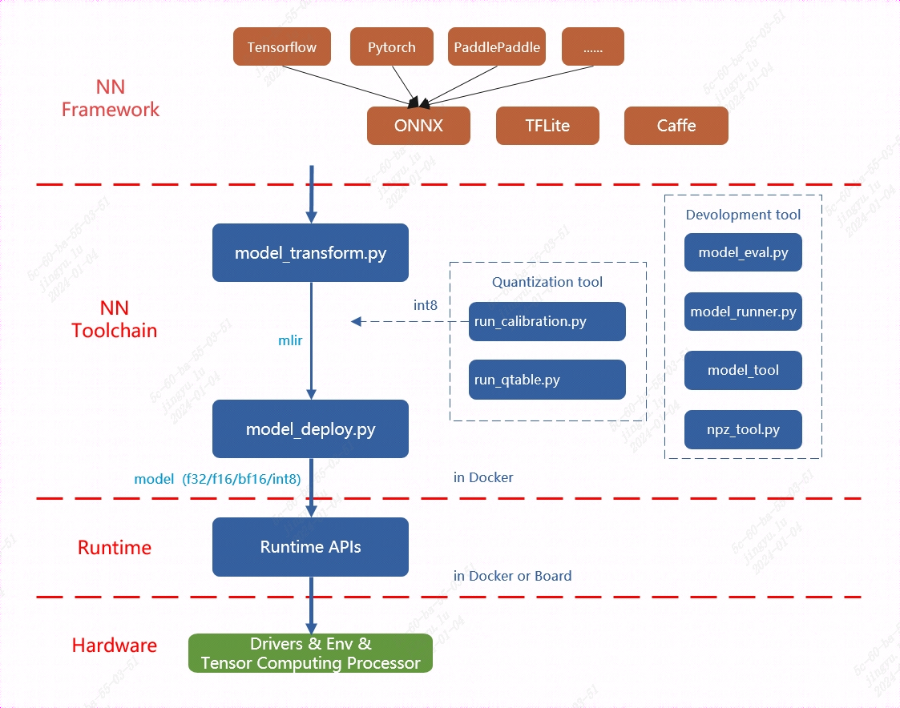
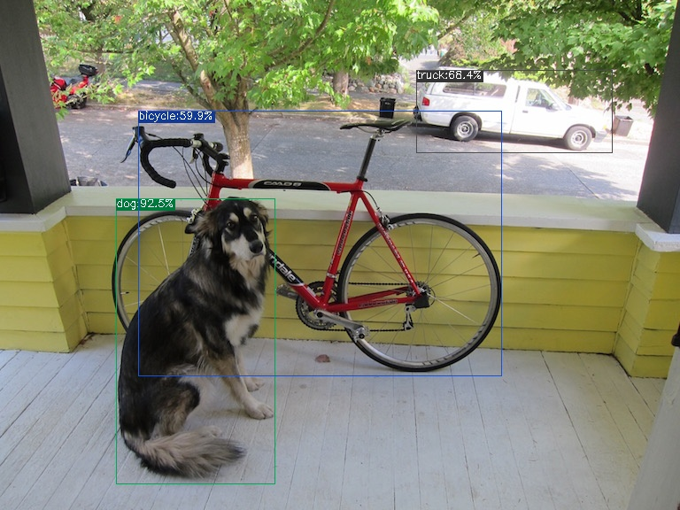

# 编程模型和语言层
##### TPU-MLIR 介绍

TPU-MLIR 是算能深度学习处理器的编译器工程，提供了一套完整的工具链，用于将不同框架下预训练的神经网络转化为可以在算能智能视觉深度学习处理器上高效运行的模型文件（BModel/CviModel）。

##### 主要特点

1. 支持多种框架：直接支持 PyTorch、ONNX、TFLite 和 Caffe 等框架模型的转换。
2. 开源：代码已开源到 GitHub（https://github.com/sophgo/tpu-mlir）。
3. 学术支持：有相关论文描述其整体设计思路（https://arxiv.org/abs/2210.15016）。

##### 架构概览

TPU-MLIR 的整体架构包括以下主要组件：

1. 前端转换：将各种框架的模型转换为 MLIR 表示。
2. 优化阶段：对 MLIR 进行各种优化。
3. 后端生成：生成可在 TPU 上运行的 BModel/CviModel。

#####  使用流程

###### 1. 模型转换

使用 `model_transform` 工具将原始模型转换成 MLIR 文件。

###### 2. 量化（可选）

如需 INT8 量化：
- 使用 `run_calibration` 生成校准表。
- 使用 `run_qtable` 生成量化表（用于决定哪些层采用浮点计算）。

###### 3. 模型部署

使用 `model_deploy` 将 MLIR 文件转换成 BModel/CviModel。

##### Lowering 过程
TPU-MLIR使用两种主要的方言：TOP（Tensor Operator）和TPU。

- TOP方言：
  - 硬件无关层
  - 支持F32/F16/BF16/INT8对称/INT8非对称等类型
  - 代表了网络的高级表示

- TPU方言：
  - 硬件相关层
  - 针对特定TPU硬件优化
  - 包含了硬件特定的量化和优化策略


Lowering是将TOP层OP下沉到TPU层OP的过程：
- 将算子从硬件无关层(TOP)转换到硬件相关层(TPU)
- 支持F32/F16/BF16/INT8对称/INT8非对称等类型转换
- 涉及量化算法，针对不同硬件有不同实现
- 处理混合精度情况，在需要时插入CastOp
Lowering 是将 TOP 层 OP 下沉到 TPU 层 OP 的过程：

- 支持 F32/F16/BF16/INT8 对称/INT8 非对称等类型转换
- 处理混合精度情况，在需要时插入 CastOp

##### CodeGen 过程

CodeGen 是将 MLIR 文件转换为最终 BModel 的过程，主要包括：

1. 指令生成：执行不同 op 的 CodeGen 接口，生成相应的二进制指令
2. 指令存储：使用 store_cmd 将指令存储在指定数据结构中
3. 指令取出：所有 op 的二进制码生成完毕后，调用 BM168X 系列类中封装的函数取出指令，最终生成 BModel

##### 后端实现

- 使用动态库（libbackend_xxx.so）封装硬件后端
- 通过函数指针加载后端函数
- 使用 EngineStorer 和 CmdStorer 系列类管理指令存储
- 采用单例模式和装饰器模式实现灵活的指令管理

通过这种设计，TPU-MLIR 能够有效地将各种深度学习框架的模型转换为可在 TPU 上高效运行的 BModel，同时提供了灵活的优化和定制空间。


基于提供的上下文，我可以为您综合一个关于TPU-MLIR的介绍，包括TOP和TPU两种方言，以及CodeGen的过程：

##### 自定义算子开发

TPU-MLIR 支持添加自定义算子，主要步骤如下：

###### 1. 前端定义

使用 TpuLang 接口定义自定义算子：

```python
import transform.TpuLang as tpul

tpul.init("BM1684X", True)

# 定义输入
x = tpul.Tensor(dtype="float32", shape=[1, 3, 224, 224], name="input")

# 添加自定义算子
def shape_func(tensors_in):
    return [tensors_in[0].shape]

outs = tpul.custom(
    tensors_in=[x],
    shape_func=shape_func,
    op_name="custom_op_name",
    params={"param1": value1, "param2": value2},
    out_dtypes=["float32"],
    out_names=["custom_out"]
)

# 编译生成 MLIR
tpul.compile("model_name", [x], outs, False, 2, has_custom=True)
```

###### 2. 后端实现

1. 在 `$TPUC_ROOT/customlayer/include` 添加头文件。
2. 在 `$TPUC_ROOT/customlayer/src` 添加实现文件。
3. 在 `backend_custom_param.h` 定义参数结构体。
4. 添加 API 接口文件。
5. 在 `backend_custom_api.cpp` 定义后端调用接口。
6. 运行 `$TPUC_ROOT/customlayer/build.sh` 编译生成动态库。


TPU-MLIR 提供了一个强大的工具链，支持从多种深度学习框架到 TPU 可执行模型的转换。通过支持自定义算子，它为开发者提供了极大的灵活性，使得复杂的深度学习模型能够在 TPU 上高效运行。结合 TPUPerf 工具，开发者可以全面优化和验证其模型性能。
TPU平台专门支持BModel模型加速，因此在使用TPU之前，必须进行模型迁移。通过利用MLIR工具链，可以将在其他框架中训练的模型转换为BModel，从而实现TPU的兼容运行。
MLIR已经直接支持绝大多数开源框架（如Pytorch、ONNX、TFLite和Caffe）中的算子和模型，而对于其他框架（如TensorFlow和PaddlePaddle），则需要先将其转换为ONNX模型，然后再进行后续转换。这一过程的整体架构可以参见TPU-MLIR工具链示意图。

模型转换主要包括两个步骤。首先，通过 `model_transform.py` 脚本将原始模型转换为 MLIR 文件。然后，使用 `model_deploy.py` 脚本将生成的 MLIR 文件转换为 BModel。

在生成浮点型模型时，`model_deploy.py` 工具支持输出三种不同的浮点数据类型：F32、F16 和 BF16。而对于 INT8 模型，首先需要准备一个量化数据集，并调用 `run_calibration.py` 生成校准表。接着，将校准表传递给 `model_deploy.py` 以完成 INT8 模型的生成。

如果生成的 INT8 模型精度不符合要求，可以使用 `run_qtable.py` 工具生成量化表，量化表用于决定哪些网络层使用浮点计算，随后将该量化表传递给 `model_deploy.py`，以生成混合精度模型。

#### 以 yolov5s.onnx 为例, 介绍如何编译迁移一个onnx模型至BM1684X 平台运行。
在与 `tpu-mlir` 同级的目录下创建一个名为 `model_yolov5s` 的目录，并将模型文件和图片文件都放入该目录。具体步骤如下：
- 进入正确的父目录**：确保位于与 `tpu-mlir` 同级的目录中。例如：

   ```bash
   cd /path/to/your/parent_directory
   ```

- 创建 `model_yolov5s` 目录：

   ```bash
   mkdir model_yolov5s
   ```

- 将模型文件和COCO2017数据集图片文件复制到新建的 `model_yolov5s` 目录中：

   ```bash
   cp /path/to/your/model_file /path/to/your/image_file ./model_yolov5s/
   ```

   确保将模型文件（例如 `.pt`、`.onnx`、`.mlir` 等格式的文件）和图片文件（例如 `.jpg`、`.png` 等格式的图片）都放入 `model_yolov5s` 目录中。
完成后，目录结构应该类似于以下形式：

```
/parent_directory
  ├── tpu-mlir
  └── model_yolov5s
      ├── your_model_file
      └── your_image_file
```
如果模型的输入是图片格式，在进行模型转换前，必须先了解并执行必要的预处理操作。然而，如果模型输入的是已经经过预处理的 npz 文件，则无需再进行额外的预处理步骤。在官方的 YOLOv5 模型中，图片输入采用 RGB 格式，并且每个像素值都会乘以 1/255 进行归一化处理。这相当于将每个像素的值缩放至 0 到 1 之间。对应地，转换时的 mean（均值）为 [0.0, 0.0, 0.0]，而 scale（缩放系数）为 [0.0039216, 0.0039216, 0.0039216]，因为 1/255 等于 0.0039216。
模型转换命令如下:
```
$ model_transform.py \
    --model_name yolov5s \
    --model_def ../yolov5s.onnx \
    --input_shapes [[1,3,640,640]] \
    --mean 0.0,0.0,0.0 \
    --scale 0.0039216,0.0039216,0.0039216 \
    --keep_aspect_ratio \
    --pixel_format rgb \
    --output_names 350,498,646 \
    --test_input ../image/dog.jpg \
    --test_result yolov5s_top_outputs.npz \
    --mlir yolov5s.mlir
```
在模型转换为 MLIR 文件后，会生成一个名为 `${model_name}_in_f32.npz` 的文件。该文件包含模型的输入数据，以 `.npz` 格式存储，通常用于模型推理时作为输入文件，确保数据格式与模型的输入要求一致。
将 MLIR 文件转换为 F32 格式的 BModel，操作步骤如下：
```
$ model_deploy.py \
     --mlir yolov5s.mlir \
     --quantize F32 \
     --chip bm1684x \
     --test_input yolov5s_in_f32.npz \
     --test_reference yolov5s_top_outputs.npz \
     --tolerance 0.99,0.99 \
     --model yolov5s_1684x_f32.bmodel
```
编译完成后, 会生成名为 yolov5s_1684x_f32.bmodel 的文件。
将 MLIR 文件转换为 F16 格式的 BModel，具体操作步骤如下：
```
$ model_deploy.py \
    --mlir yolov5s.mlir \
    --quantize F16 \
    --chip bm1684x \
    --test_input yolov5s_in_f32.npz \
    --test_reference yolov5s_top_outputs.npz \
    --model yolov5s_1684x_f16.bmodel
```
编译完成后, 会生成名为 yolov5s_1684x_f16.bmodel 的文件。
在转换为 INT8 模型之前，首先需要运行校准过程（calibration）来生成校准表。校准过程中，输入的数据数量根据具体需求准备，通常在 100 到 1000 张图片左右。

生成校准表后，可以选择生成对称或非对称的 BModel。如果对称模型能满足需求，通常不建议使用非对称模型，因为非对称模型的性能会稍逊于对称模型。

以下是使用现有的 100 张来自 COCO2017 数据集的图片作为示例，执行校准的步骤：

- 准备校准数据集：确保已经准备好 100 张 COCO2017 的图片，并将其放置在指定的目录中。

- 运行校准命令：通过以下命令运行校准，生成校准表：
```
$ run_calibration.py yolov5s.mlir \
    --dataset ../COCO2017 \
    --input_num 100 \
    -o yolov5s_cali_table
```

- 生成 INT8 模型：使用生成的校准表，执行以下命令，将校准表传递给 `model_deploy.py` 以生成对称或非对称的 INT8 BModel：

```
$ model_deploy.py \
    --mlir yolov5s.mlir \
    --quantize INT8 \
    --calibration_table yolov5s_cali_table \
    --chip bm1684x \
    --test_input yolov5s_in_f32.npz \
    --test_reference yolov5s_top_outputs.npz \
    --tolerance 0.85,0.45 \
    --model yolov5s_1684x_int8_sym.bmodel
```

如果对称模型能够满足精度要求，通常选择对称模式，因为它的性能表现优于非对称模型。编译完成后, 会生成名为 yolov5s_1684x_int8_sym.bmodel 的文件。
#### 效果检验。
完成目标检测的整个流程，包括数据预处理、推理、后处理（NMS）和结果的可视化。
- 图像预处理：将输入图像缩放到模型接受的尺寸。
- 推理：调用 mlir_inference 或 onnx_inference 等模型推理函数，得到检测结果。
- 后处理：通过 postproc 函数解析模型输出，结合锚点生成预测框和类别。
- NMS：通过 multiclass_nms 函数对预测框进行非极大值抑制，过滤冗余框。
- 可视化：使用 vis 函数将检测结果绘制到图像上，展示检测出的物体和对应类别。
  部分重要代码如下：
```python
import numpy as np
import cv2

COCO_CLASSES = ("person", "bicycle", "car", "motorcycle", "airplane", "bus", "train", "truck", ...)
_COLORS = np.array([...]).astype(np.float32).reshape(-1, 3)
ANCHORS = {8: [[1.25, 1.625], [2.0, 3.75], [4.125, 2.875]], ...}

def vis(img, boxes, scores, cls_ids, conf=0.5, class_names=None):
    for i in range(len(boxes)):
        if scores[i] < conf: continue
        box, cls_id = boxes[i], int(cls_ids[i])
        color = (_COLORS[cls_id] * 255).astype(np.uint8).tolist()
        text = '{}:{:.1f}%'.format(class_names[cls_id], scores[i] * 100)
        cv2.rectangle(img, (int(box[0]), int(box[1])), (int(box[2]), int(box[3])), color, 1)
        cv2.putText(img, text, (int(box[0]), int(box[1])), cv2.FONT_HERSHEY_SIMPLEX, 0.4, (0, 0, 0), 1)
    return img

def nms(boxes, scores, iou_thres):
    x1, y1, x2, y2 = boxes[:, 0], boxes[:, 1], boxes[:, 2], boxes[:, 3]
    areas = (x2 - x1 + 1) * (y2 - y1 + 1)
    order = scores.argsort()[::-1]
    keep = []
    while order.size > 0:
        i = order[0]
        keep.append(i)
        xx1 = np.maximum(x1[i], x1[order[1:]])
        yy1 = np.maximum(y1[i], y1[order[1:]])
        xx2 = np.minimum(x2[i], x2[order[1:]])
        yy2 = np.minimum(y2[i], y2[order[1:]])
        inter = np.maximum(0.0, xx2 - xx1 + 1) * np.maximum(0.0, yy2 - yy1 + 1)
        ovr = inter / (areas[i] + areas[order[1:]] - inter)
        order = order[np.where(ovr <= iou_thres)[0] + 1]
    return keep

def multiclass_nms(boxes, scores, iou_thres, score_thres, class_agnostic=False):
    if class_agnostic:
        cls_inds, cls_scores = scores.argmax(1), scores.max(1)
    else:
        final_dets, num_classes = [], scores.shape[1]
        for cls_ind in range(num_classes):
            valid_mask = scores[:, cls_ind] > score_thres
            if valid_mask.sum() > 0:
                keep = nms(boxes[valid_mask], scores[valid_mask, cls_ind], iou_thres)
                if keep: final_dets.append(np.hstack([boxes[valid_mask][keep], scores[valid_mask][keep, None], np.full((len(keep), 1), cls_ind)]))
        return np.vstack(final_dets) if final_dets else None

def preproc(img, input_size):
    r = min(input_size[0] / img.shape[0], input_size[1] / img.shape[1])
    resized_img = cv2.resize(img, (int(img.shape[1] * r), int(img.shape[0] * r)), interpolation=cv2.INTER_LINEAR)
    padded_img = np.ones(input_size + (3,), dtype=np.uint8) * 114
    padded_img[:resized_img.shape[0], :resized_img.shape[1]] = resized_img
    return np.ascontiguousarray(padded_img.transpose((2, 0, 1)), dtype=np.float32), r

def make_grid(nx, ny, stride, anchor):
    return np.stack(np.meshgrid(np.arange(nx), np.arange(ny)), -1), np.array(anchor).reshape(1, len(anchor), 1, 1, 2)


```
用以上代码分别来验证onnx/f16/f32的执行结果。
onnx模型的执行方式如下, 得到 dog_onnx.jpg :
```
$ detect_yolov5.py \
    --input ../image/dog.jpg \
    --model ../yolov5s.onnx \
    --output dog_onnx.jpg
```
f16 bmodel的执行方式如下, 得到 dog_f16.jpg :
```
$ detect_yolov5.py \
    --input ../image/dog.jpg \
    --model yolov5s_1684x_f16.bmodel \
    --output dog_f16.jpg
```
int8对称bmodel的执行方式如下, 得到 dog_f32.jpg :
```
$ detect_yolov5.py \
    --input ../image/dog.jpg \
    --model yolov5s_1684x_f32.bmodel \
    --output dog_f32.jpg
```

dog_onnx.jpg:


dog_f16.jpg:



dog_f32.jpg:


