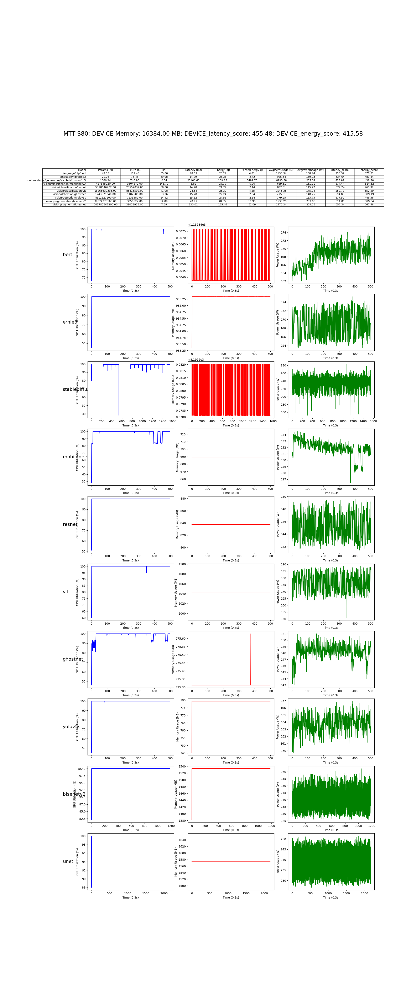

# 框架模型层
使用基于 PyTorch 的经典深度学习模型集合在 CUDA 平台上对 GPU NVIDIA 进行性能测试

仓库地址：[AI-Benchmark-SDU](https://github.com/AII-SDU/AI-Benchmark-SDU)

部分模型代码展示：
Vsion Transformer
``` python
import torch_musa
import torch
import torch.nn as nn
from thop import profile
from model.model_set.model_base import BaseModel

class PatchEmbedding(nn.Module):
    def __init__(self, img_size=224, patch_size=16, in_channels=3, embed_dim=768):
        super(PatchEmbedding, self).__init__()
        self.img_size = img_size
        self.patch_size = patch_size
        self.grid_size = img_size // patch_size
        self.num_patches = self.grid_size ** 2

        self.proj = nn.Conv2d(in_channels, embed_dim, kernel_size=patch_size, stride=patch_size)

    def forward(self, x):
        x = self.proj(x)
        x = x.flatten(2)
        x = x.transpose(1, 2)  # (B, N, D)
        return x

class Attention(nn.Module):
    def __init__(self, embed_dim, num_heads):
        super(Attention, self).__init__()
        self.num_heads = num_heads
        self.head_dim = embed_dim // num_heads
        self.scale = self.head_dim ** -0.5

        self.qkv = nn.Linear(embed_dim, embed_dim * 3)
        self.proj = nn.Linear(embed_dim, embed_dim)

    def forward(self, x):
        B, N, C = x.shape
        qkv = self.qkv(x).reshape(B, N, 3, self.num_heads, self.head_dim)
        qkv = qkv.permute(2, 0, 3, 1, 4)  # (3, B, num_heads, N, head_dim)
        q, k, v = qkv[0], qkv[1], qkv[2]

        attn = (q @ k.transpose(-2, -1)) * self.scale
        attn = attn.softmax(dim=-1)

        x = (attn @ v).transpose(1, 2).reshape(B, N, C)
        x = self.proj(x)
        return x

class MLP(nn.Module):
    def __init__(self, in_features, hidden_features, out_features, dropout=0.):
        super(MLP, self).__init__()
        self.fc1 = nn.Linear(in_features, hidden_features)
        self.act = nn.GELU()
        self.fc2 = nn.Linear(hidden_features, out_features)
        self.dropout = nn.Dropout(dropout)

    def forward(self, x):
        x = self.fc1(x)
        x = self.act(x)
        x = self.dropout(x)
        x = self.fc2(x)
        x = self.dropout(x)
        return x

class TransformerBlock(nn.Module):
    def __init__(self, embed_dim, num_heads, mlp_ratio=4., dropout=0., attention_dropout=0.):
        super(TransformerBlock, self).__init__()
        self.norm1 = nn.LayerNorm(embed_dim)
        self.attn = Attention(embed_dim, num_heads)
        self.norm2 = nn.LayerNorm(embed_dim)
        mlp_hidden_dim = int(embed_dim * mlp_ratio)
        self.mlp = MLP(embed_dim, mlp_hidden_dim, embed_dim, dropout)

    def forward(self, x):
        x = x + self.attn(self.norm1(x))
        x = x + self.mlp(self.norm2(x))
        return x

class ViT(nn.Module):
    def __init__(self, img_size=224, patch_size=16, in_channels=3, num_classes=1000, embed_dim=768, depth=12, num_heads=12, mlp_ratio=4., dropout=0., attention_dropout=0.):
        super(ViT, self).__init__()
        self.patch_embed = PatchEmbedding(img_size, patch_size, in_channels, embed_dim)
        num_patches = self.patch_embed.num_patches

        self.cls_token = nn.Parameter(torch.zeros(1, 1, embed_dim))
        self.pos_embed = nn.Parameter(torch.zeros(1, num_patches + 1, embed_dim))
        self.dropout = nn.Dropout(dropout)

        self.blocks = nn.Sequential(
            *[TransformerBlock(embed_dim, num_heads, mlp_ratio, dropout, attention_dropout) for _ in range(depth)]
        )
        self.norm = nn.LayerNorm(embed_dim)
        self.head = nn.Linear(embed_dim, num_classes)

    def forward(self, x):
        B = x.shape[0]
        x = self.patch_embed(x)

        cls_tokens = self.cls_token.expand(B, -1, -1)
        x = torch.cat((cls_tokens, x), dim=1)
        x = x + self.pos_embed
        x = self.dropout(x)

        x = self.blocks(x)
        x = self.norm(x)

        cls_token_final = x[:, 0]
        x = self.head(cls_token_final)

        return x


class vit_mthreads(BaseModel):
    def __init__(self):
        super().__init__('vision/classification/vit')
        self.input_shape =(1, 3, 224, 224)
        self.device = torch.device('musa' if torch.musa.is_available() else 'cpu')

    def get_input(self):
        self.input = torch.randn(self.input_shape).to(torch.float32).to(self.device)

    def load_model(self):
        self.model = ViT(img_size=224).to(self.device)

    def get_params_flops(self) -> list:
        # 'float [params, flops]'
        flops, params = profile(self.model, inputs=(self.input,), verbose=False)
        # print("flops, params:",flops, params)
        return [flops, params]

    def inference(self):
        self.model.eval()
        with torch.no_grad():
            output = self.model(self.input)
        return output
```
ernie3
```python
import torch_musa
from model.model_set.model_base import BaseModel
import torch
from transformers import BertTokenizer, ErnieModel
from thop import profile

class ernie3_mthreads(BaseModel):
    def __init__(self):
        super().__init__('language/nlp/ernie3')
        self.device = torch.device('musa' if torch.musa.is_available() else 'cpu') 
        self.tokenizer_path = "model/model_set/pytorch/language/nlp/ernie3/vocab"
        self.model_path = "model/model_set/pytorch/language/nlp/ernie3/vocab"
        self.tokenizer = BertTokenizer.from_pretrained(self.tokenizer_path)
        
    def get_input(self):
        self.text = "Hello, how are you?"
        self.max_length = 256
        # Tokenize input text
        self.inputs = self.tokenizer(self.text, return_tensors='pt', padding='max_length', 
                                     truncation=True, max_length=self.max_length).to(self.device)
        
    def load_model(self):

        self.model = ErnieModel.from_pretrained(self.model_path).to(self.device)

    def get_params_flops(self) -> list:
        flops, _ = profile(self.model, (self.inputs.input_ids, self.inputs.attention_mask), verbose=False)
        params = sum(p.numel() for p in self.model.parameters() if p.requires_grad)
        return flops / 1e9 * 2,  params / 1e6
    
    def inference(self):
        with torch.no_grad():  
            outputs = self.model(**self.inputs)
        return outputs
```
在 摩尔线程 MTT S80 上的测试结果：
