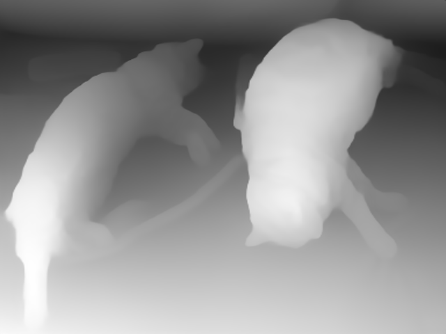
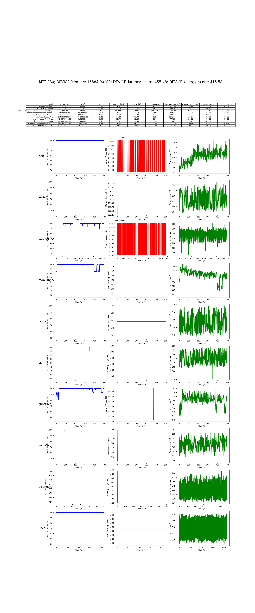

# 框架模型层
使用基于 PyTorch 的经典深度学习模型集合在 CUDA 平台上对 GPU NVIDIA 进行性能测试

仓库地址：[AI-Benchmark-SDU](https://github.com/AII-SDU/AI-Benchmark-SDU)

部分模型代码展示：
Vsion Transformer：实现了使用PyTorch框架实现一个基于视觉Transformer（ViT）的图像分类模型，并支持在MUSA上进行推理。代码实现了模型的构建、推理输入的准备、模型参数和FLOPs的计算，以及推理过程。
- PatchEmbedding 类实现了将输入图像分割成小块（Patch），并将这些图像块嵌入到较高维度的向量空间中。通过nn.Conv2d将图像块投影到高维空间。对结果进行展平和转置，使其符合Transformer的输入格式。
- Attention 类实现了Transformer中的自注意力机制。embed_dim: 输入向量的维度。num_heads: 注意力机制的多头数量。通过qkv线性层生成查询（Q）、键（K）和值（V）向量。计算注意力权重，并通过软max标准化。将注意力应用于值向量并通过proj线性层生成最终输出。
- MLP 类实现了多层感知机（MLP），通常用于Transformer中的前馈网络部分。in_features: 输入特征的维度。hidden_features: 隐藏层的特征维度。out_features: 输出特征的维度。dropout: Dropout的概率，用于正则化。应用两个全连接层，中间使用GELU激活函数，并添加Dropout层以防止过拟合。
- TransformerBlock 类是Transformer的一个基础块，包含了自注意力机制和MLP。输入首先通过注意力模块，再通过MLP模块。每一步都包含残差连接（skip connection）和Layer Normalization。
- ViT 类是一个视觉Transformer模型，它将图像输入转化为patches，通过多个Transformer块进行处理，并最终用于分类任务。将图像转换为patches并嵌入。添加分类token和位置编码。通过多个Transformer块进行处理，最后通过LayerNorm和分类头输出分类结果。
- vit_mthreads 类是一个基于BaseModel的ViT模型类，专门用于在MUSA硬件上运行。get_input: 准备一个随机输入张量，模拟输入图像数据，并将其传输到MUSA设备。load_model: 加载ViT模型到MUSA设备。get_params_flops: 使用thop.profile库计算模型的参数数量和FLOPs。inference: 执行模型推理，返回输出结果。
- 在vit_mthreads类中，模型初始化时会加载ViT模型，并生成随机的输入图像张量。在推理阶段，模型会进入eval模式，并在没有梯度计算的情况下进行推理。参数数量和FLOPs通过thop.profile库计算，并以浮点数形式返回。

``` python
import torch_musa
import torch
import torch.nn as nn
from thop import profile
from model.model_set.model_base import BaseModel

class PatchEmbedding(nn.Module):
    def __init__(self, img_size=224, patch_size=16, in_channels=3, embed_dim=768):
        super(PatchEmbedding, self).__init__()
        self.img_size = img_size
        self.patch_size = patch_size
        self.grid_size = img_size // patch_size
        self.num_patches = self.grid_size ** 2

        self.proj = nn.Conv2d(in_channels, embed_dim, kernel_size=patch_size, stride=patch_size)

    def forward(self, x):
        x = self.proj(x)
        x = x.flatten(2)
        x = x.transpose(1, 2)  # (B, N, D)
        return x

class Attention(nn.Module):
    def __init__(self, embed_dim, num_heads):
        super(Attention, self).__init__()
        self.num_heads = num_heads
        self.head_dim = embed_dim // num_heads
        self.scale = self.head_dim ** -0.5

        self.qkv = nn.Linear(embed_dim, embed_dim * 3)
        self.proj = nn.Linear(embed_dim, embed_dim)

    def forward(self, x):
        B, N, C = x.shape
        qkv = self.qkv(x).reshape(B, N, 3, self.num_heads, self.head_dim)
        qkv = qkv.permute(2, 0, 3, 1, 4)  # (3, B, num_heads, N, head_dim)
        q, k, v = qkv[0], qkv[1], qkv[2]

        attn = (q @ k.transpose(-2, -1)) * self.scale
        attn = attn.softmax(dim=-1)

        x = (attn @ v).transpose(1, 2).reshape(B, N, C)
        x = self.proj(x)
        return x

class MLP(nn.Module):
    def __init__(self, in_features, hidden_features, out_features, dropout=0.):
        super(MLP, self).__init__()
        self.fc1 = nn.Linear(in_features, hidden_features)
        self.act = nn.GELU()
        self.fc2 = nn.Linear(hidden_features, out_features)
        self.dropout = nn.Dropout(dropout)

    def forward(self, x):
        x = self.fc1(x)
        x = self.act(x)
        x = self.dropout(x)
        x = self.fc2(x)
        x = self.dropout(x)
        return x

class TransformerBlock(nn.Module):
    def __init__(self, embed_dim, num_heads, mlp_ratio=4., dropout=0., attention_dropout=0.):
        super(TransformerBlock, self).__init__()
        self.norm1 = nn.LayerNorm(embed_dim)
        self.attn = Attention(embed_dim, num_heads)
        self.norm2 = nn.LayerNorm(embed_dim)
        mlp_hidden_dim = int(embed_dim * mlp_ratio)
        self.mlp = MLP(embed_dim, mlp_hidden_dim, embed_dim, dropout)

    def forward(self, x):
        x = x + self.attn(self.norm1(x))
        x = x + self.mlp(self.norm2(x))
        return x

class ViT(nn.Module):
    def __init__(self, img_size=224, patch_size=16, in_channels=3, num_classes=1000, embed_dim=768, depth=12, num_heads=12, mlp_ratio=4., dropout=0., attention_dropout=0.):
        super(ViT, self).__init__()
        self.patch_embed = PatchEmbedding(img_size, patch_size, in_channels, embed_dim)
        num_patches = self.patch_embed.num_patches

        self.cls_token = nn.Parameter(torch.zeros(1, 1, embed_dim))
        self.pos_embed = nn.Parameter(torch.zeros(1, num_patches + 1, embed_dim))
        self.dropout = nn.Dropout(dropout)

        self.blocks = nn.Sequential(
            *[TransformerBlock(embed_dim, num_heads, mlp_ratio, dropout, attention_dropout) for _ in range(depth)]
        )
        self.norm = nn.LayerNorm(embed_dim)
        self.head = nn.Linear(embed_dim, num_classes)

    def forward(self, x):
        B = x.shape[0]
        x = self.patch_embed(x)

        cls_tokens = self.cls_token.expand(B, -1, -1)
        x = torch.cat((cls_tokens, x), dim=1)
        x = x + self.pos_embed
        x = self.dropout(x)

        x = self.blocks(x)
        x = self.norm(x)

        cls_token_final = x[:, 0]
        x = self.head(cls_token_final)

        return x


class vit_mthreads(BaseModel):
    def __init__(self):
        super().__init__('vision/classification/vit')
        self.input_shape =(1, 3, 224, 224)
        self.device = torch.device('musa' if torch.musa.is_available() else 'cpu')

    def get_input(self):
        self.input = torch.randn(self.input_shape).to(torch.float32).to(self.device)

    def load_model(self):
        self.model = ViT(img_size=224).to(self.device)

    def get_params_flops(self) -> list:
        # 'float [params, flops]'
        flops, params = profile(self.model, inputs=(self.input,), verbose=False)
        # print("flops, params:",flops, params)
        return [flops, params]

    def inference(self):
        self.model.eval()
        with torch.no_grad():
            output = self.model(self.input)
        return output
```
定义一个基于 U-Net 的神经网络，并在摩尔线程 GPU（MUSA）上执行前向推理（inference），计算其每秒帧数（FPS）。
- in_channels 和 out_channels 分别是输入和输出的通道数。每个卷积层后接一个 ReLU 激活函数，用于引入非线性。forward 方法：在前向传播中，依次通过两层卷积和 ReLU，得到输出。
- 使用 MaxPool2d(2) 进行 2×2 最大池化，减少特征图的分辨率。
- 通过 ConvTranspose2d（转置卷积）扩大特征图的分辨率。
- center_crop 用于裁剪下采样路径的特征图，使其与当前特征图大小一致，然后使用 torch.cat 在通道维度上进行拼接。
- 采样路径中的卷积模块和池化操作（通过 down_conv 和 down_sample）。底部的卷积层（middle_conv）。上采样路径中的转置卷积层和卷积层（up_sample 和 up_conv）。用于拼接的 CropAndConcat 模块（concat）。最终的 1×1 卷积层输出结果（final_conv）。
- 下采样路径：先通过卷积，记录每个层的输出用于后续拼接。底部卷积：通过两层 3×3 卷积。上采样路径：先上采样，然后拼接对应下采样的输出，再通过卷积。最终通过 1×1 卷积层输出结果。
- device = torch.device('musa' if torch.musa.is_available() else 'cpu')：检查是否有摩尔线程（MUSA）GPU可用，如果有则使用，否则使用 CPU。model = unet(out_channels=1000).to(device)：创建一个 U-Net 模型，将输出通道数设为 1000 并将其加载到选定的设备上（GPU 或 CPU）。input_tensor = torch.randn(1, 3, 224, 224).to(device)：创建一个随机的输入张量，模拟大小为 1×3×224×224 的图像，并将其移动到设备上。
- 执行 128 次前向传播，计算总耗时。通过每次的平均推理时间来计算每秒帧数（FPS），公式为：FPS = 1000 / latency。
```python
import torch
import torchvision.transforms.functional
from torch import nn
import torch_musa

class DoubleConvolution(nn.Module):
    """
    ### Two $3 \times 3$ Convolution Layers
    Each step in the contraction path and expansive path have two $3 \times 3$
    convolutional layers followed by ReLU activations.

    In the U-Net paper they used $0$ padding,
    but we use $1$ padding so that final feature map is not cropped.
    """
    def __init__(self, in_channels: int, out_channels: int):
        """
        :param in_channels: is the number of input channels
        :param out_channels: is the number of output channels
        """
        super().__init__()

        # First $3 \times 3$ convolutional layer
        self.first = nn.Conv2d(in_channels, out_channels, kernel_size=3, padding=1)
        self.act1 = nn.ReLU()
        # Second $3 \times 3$ convolutional layer
        self.second = nn.Conv2d(out_channels, out_channels, kernel_size=3, padding=1)
        self.act2 = nn.ReLU()

    def forward(self, x: torch.Tensor):
        # Apply the two convolution layers and activations
        x = self.first(x)
        x = self.act1(x)
        x = self.second(x)
        return self.act2(x)

class DownSample(nn.Module):
    """
    ### Down-sample

    Each step in the contracting path down-samples the feature map with
    a $2 \times 2$ max pooling layer.
    """

    def __init__(self):
        super().__init__()
        # Max pooling layer
        self.pool = nn.MaxPool2d(2)

    def forward(self, x: torch.Tensor):
        return self.pool(x)

class UpSample(nn.Module):
    """
    ### Up-sample

    Each step in the expansive path up-samples the feature map with
    a $2 \times 2$ up-convolution.
    """
    def __init__(self, in_channels: int, out_channels: int):
        super().__init__()

        # Up-convolution
        self.up = nn.ConvTranspose2d(in_channels, out_channels, kernel_size=2, stride=2)

    def forward(self, x: torch.Tensor):
        return self.up(x)

class CropAndConcat(nn.Module):
    """
    ### Crop and Concatenate the feature map

    At every step in the expansive path the corresponding feature map from the contracting path
    concatenated with the current feature map.
    """
    def forward(self, x: torch.Tensor, contracting_x: torch.Tensor):
        """
        :param x: current feature map in the expansive path
        :param contracting_x: corresponding feature map from the contracting path
        """

        # Crop the feature map from the contracting path to the size of the current feature map
        contracting_x = torchvision.transforms.functional.center_crop(contracting_x, [x.shape[2], x.shape[3]])
        # Concatenate the feature maps
        x = torch.cat([x, contracting_x], dim=1)
        #
        return x

class unet(nn.Module):
    """
    ## U-Net
    """
    def __init__(self, in_channels=3, out_channels=19):
        """
        :param in_channels: number of channels in the input image
        :param out_channels: number of channels in the result feature map
        """
        super().__init__()

        # Double convolution layers for the contracting path.
        # The number of features gets doubled at each step starting from $64$.
        self.down_conv = nn.ModuleList([DoubleConvolution(i, o) for i, o in
                                        [(in_channels, 64), (64, 128), (128, 256), (256, 512)]])
        # Down sampling layers for the contracting path
        self.down_sample = nn.ModuleList([DownSample() for _ in range(4)])

        # The two convolution layers at the lowest resolution (the bottom of the U).
        self.middle_conv = DoubleConvolution(512, 1024)

        # Up sampling layers for the expansive path.
        # The number of features is halved with up-sampling.
        self.up_sample = nn.ModuleList([UpSample(i, o) for i, o in
                                        [(1024, 512), (512, 256), (256, 128), (128, 64)]])
        # Double convolution layers for the expansive path.
        # Their input is the concatenation of the current feature map and the feature map from the
        # contracting path. Therefore, the number of input features is double the number of features
        # from up-sampling.
        self.up_conv = nn.ModuleList([DoubleConvolution(i, o) for i, o in
                                      [(1024, 512), (512, 256), (256, 128), (128, 64)]])
        # Crop and concatenate layers for the expansive path.
        self.concat = nn.ModuleList([CropAndConcat() for _ in range(4)])
        # Final $1 \times 1$ convolution layer to produce the output
        self.final_conv = nn.Conv2d(64, out_channels, kernel_size=1)

    def forward(self, x: torch.Tensor):
        """
        :param x: input image
        """
        # To collect the outputs of contracting path for later concatenation with the expansive path.
        pass_through = []
        # Contracting path
        for i in range(len(self.down_conv)):
            # Two $3 \times 3$ convolutional layers
            x = self.down_conv[i](x)
            # Collect the output
            pass_through.append(x)
            # Down-sample
            x = self.down_sample[i](x)

        # Two $3 \times 3$ convolutional layers at the bottom of the U-Net
        x = self.middle_conv(x)

        # Expansive path
        for i in range(len(self.up_conv)):
            # Up-sample
            x = self.up_sample[i](x)
            # Concatenate the output of the contracting path
            x = self.concat[i](x, pass_through.pop())
            # Two $3 \times 3$ convolutional layers
            x = self.up_conv[i](x)

        # Final $1 \times 1$ convolution layer
        x = self.final_conv(x)
        return x
def main():
    # 检查是否有GPU可用，并使用
    device = torch.device('musa' if torch.musa.is_available() else 'cpu')
    print(f'Using device: {device}')
    # 创建 U-Net 模型并将其移动到GPU上
    model = unet(out_channels=1000).to(device)
    # 创建一个随机输入张量
    input_tensor = torch.randn(1, 3, 224, 224).to(device)
    t_start = time.time()
    iterations = 128
    for _ in range(iterations):
        with torch.no_grad():
            outputs = model(input_tensor)
    elapsed_time = time.time() - t_start
    latency = elapsed_time / iterations * 1000
    FPS = 1000 / latency
    print(f"FPS: {FPS:.2f}")     
    # 测试
    # 输出结果张量的形状
    print(f'Output shape: {outputs.shape}')
if __name__ == '__main__':
    main()

```
结果

```
Using device: musa
FPS: 13.08
Output shape: torch.Size([1, 1000, 224, 224])
```


通过使用DPTForDepthEstimation模型执行深度估计任务，并且可以在MUSA加速设备（或CPU）上进行推理。代码的主要功能是对一张输入图像进行多次深度估计推理，计算每次推理的延迟和FPS，然后保存深度估计的结果。
- DPTImageProcessor 用于对输入图像进行预处理，将其转换为模型可接受的格式。DPTForDepthEstimation 是深度估计模型，将其加载并移动到MUSA或CPU上。low_cpu_mem_usage=True 参数允许更高效地加载模型，适用于内存受限的环境。
- 从给定URL下载并加载图像，这里是COCO数据集中一张图像。
- 使用预训练的图像处理器将图像转化为模型所需的张量格式，并将张量数据转移到设备（MUSA或CPU）上。
- 使用torch.no_grad()进行推理，避免计算梯度，节省内存。通过循环运行推理128次，记录总用时来计算每次推理的延迟（毫秒）和FPS（每秒帧数）。
- torch.nn.functional.interpolate 用于将深度预测结果插值回原始图像的大小，这里使用bicubic插值方法。
- 将预测结果转回CPU，并通过NumPy格式化为图像数据。通过PIL库将NumPy数组转换为图像格式，并保存为PNG格式。检查输出文件夹是否存在，如果不存在则创建该文件夹。最终将深度估计图像保存到指定路径。
```python
from PIL import Image
import numpy as np
import requests
import torch
import time
from transformers import DPTImageProcessor, DPTForDepthEstimation
import torch_musa
# 检查是否有可用的GPU
device = torch.device("musa" if torch.musa.is_available() else "cpu")

# 加载模型和处理器
image_processor = DPTImageProcessor.from_pretrained("Intel/dpt-hybrid-midas")
model = DPTForDepthEstimation.from_pretrained("Intel/dpt-hybrid-midas", low_cpu_mem_usage=True).to(device)  # 将模型转移到GPU

url = "http://images.cocodataset.org/val2017/000000039769.jpg"
image = Image.open(requests.get(url, stream=True).raw)

# 准备图像输入，并将张量转移到GPU
inputs = image_processor(images=image, return_tensors="pt").to(device)

name = "cat"
t_start = time.time()
iterations = 128  
    # 模型推理
for _ in range(iterations):
    with torch.no_grad():
        outputs = model(**inputs)
        predicted_depth = outputs.predicted_depth
elapsed_time = time.time() - t_start
latency = elapsed_time / iterations * 1000
FPS = 1000 / latency
print(f"FPS: {FPS:.2f}") 

# 将预测结果插值到原始大小
prediction = torch.nn.functional.interpolate(
    predicted_depth.unsqueeze(1),
    size=image.size[::-1],
    mode="bicubic",
    align_corners=False,
)

# 将预测张量转移回CPU，以便进行后处理
output = prediction.squeeze().cpu().numpy()
formatted = (output * 255 / np.max(output)).astype("uint8")
depth = Image.fromarray(formatted)

# 指定保存路径
output_folder = "/home/Benchmark/Intel"
# 确保输出文件夹存在
import os
if not os.path.exists(output_folder):
    os.makedirs(output_folder)

# 拼接完整的路径和文件名
depth_image_path = os.path.join(output_folder, name + "_depth_image.png")
depth.save(depth_image_path)
print(f"图像已保存为 {depth_image_path}")
```
生成的深度图结果如下图：



使用diffusers库中的AnimateDiffPipeline和MotionAdapter在MUSA设备上生成视频帧，并将其导出为GIF格式。
- MotionAdapter和AnimateDiffPipeline分别加载用于动画生成和视频生成的预训练模型。MotionAdapter帮助处理动作相关的输入，AnimateDiffPipeline处理视频生成管道。to(device)将这些模型加载到MUSA设备上。
- 通过LCMScheduler设定调度器，并且选择linear的beta_schedule，这会影响模型的推理过程。
- 加载LoRA权重，LoRA是一种轻量化模型微调方法，允许有效地应用适配器。设置adapter名称为lcm-lora，并使用权重系数0.8来调整模型中LoRA适配器的影响力。
- 启用VAE切片可以在生成过程中减少显存消耗，使得在内存有限的设备上生成更大尺寸的视频帧。
- prompt：提供一个详细的描述，指导生成的内容（例如火箭发射）。negative_prompt：负面提示词，用来减少不希望看到的特性（例如低质量图像）。num_frames：生成的帧数。guidance_scale：控制生成图像依赖提示词的强度。num_inference_steps：控制推理步数，步数越高，生成质量越高，但时间也更长。generator：设置一个随机生成器并固定种子，以便生成一致的结果。
- 每次推理结束后，计算推理的延迟和FPS。
```python
import torch
import torch_musa
from diffusers import AnimateDiffPipeline, LCMScheduler, MotionAdapter
from diffusers.utils import export_to_gif
import time
# 检查MUSA设备是否可用

if torch_musa.is_available():
    device = torch.device("musa")
else:
    raise EnvironmentError("MUSA device is not available. Please check your MUSA setup.")

# 加载MotionAdapter和AnimateDiffPipeline到MUSA
adapter = MotionAdapter.from_pretrained(
    "/home/Benchmark/video-generate/models--wangfuyun--AnimateLCM/snapshots/6cdc714205bbc04c3b2031ee63725cd6e54dbe56", 
    torch_dtype=torch.float32
).to(device)

pipe = AnimateDiffPipeline.from_pretrained(
    "/home/Benchmark/video-generate/models--emilianJR--epiCRealism/snapshots/6522cf856b8c8e14638a0aaa7bd89b1b098aed17", 
    motion_adapter=adapter, 
    torch_dtype=torch.float32
).to(device)

# 设置调度器
pipe.scheduler = LCMScheduler.from_config(pipe.scheduler.config, beta_schedule="linear")

# 加载LoRA权重并应用适配器
pipe.load_lora_weights(
    "/home/Benchmark/video-generate/models--wangfuyun--AnimateLCM/snapshots/6cdc714205bbc04c3b2031ee63725cd6e54dbe56", 
    weight_name="AnimateLCM_sd15_t2v_lora.safetensors", 
    adapter_name="lcm-lora"
)
pipe.set_adapters(["lcm-lora"], [0.8])

# 启用VAE切片
pipe.enable_vae_slicing()
t_start = time.time()
iterations = 4


for _ in range(iterations): 
# 生成视频帧
    output = pipe(
        prompt="A space rocket with trails of smoke behind it launching into space from the desert, 4k, high resolution",
        negative_prompt="bad quality, worse quality, low resolution",
        num_frames=3,  # 帧数
        guidance_scale=2.0, #提示词依赖度
        num_inference_steps=50,  # 推理步数
        generator=torch.Generator("cpu").manual_seed(0),
    )
elapsed_time = time.time() - t_start
latency = elapsed_time / iterations * 1000
FPS = 1000 / latency
print(f"FPS: {FPS:.3f}")
# 导出为GIF
frames = output.frames[0]
export_to_gif(frames, "animatelcm1.gif")

```
生成的结果图如下：


Ernie3：使用BERTTokenizer和ErnieModel在MUSA设备上运行一个自然语言处理模型，并进行推理、计算模型参数和FLOPs。代码中的模型是基于ERNIE的一个实现，具有类似BERT的结构。
- ernie3_mthreads 类是一个基于ERNIE的自然语言处理模型，使用了BaseModel作为基类，专门为MUSA硬件设计。主要功能包括加载模型、准备输入、推理以及计算FLOPs和参数。
- 使用BERTTokenizer进行文本的预处理，ErnieModel作为核心的语言模型，通过MUSA进行加速推理。
- get_input 方法方法负责准备输入数据：设置了输入文本为"Hello, how are you?"。使用BERT的分词器将文本转换为张量，包含了输入的input_ids和attention_mask。分词后的输入被发送到MUSA设备。
- 使用ErnieModel从指定路径加载预训练模型并将其移动到MUSA设备上。使用thop.profile库计算模型在推理过程中执行的FLOPs（浮点运算量），并以GFLOPs为单位返回。通过model.parameters()计算所有需要梯度更新的参数总数，并将其转换为百万参数量（M参数）。结果以GFLOPs和百万参数量的形式返回。
- 模型被设置为推理模式（不更新梯度）。使用准备好的输入在MUSA设备上进行推理，并返回输出。

```python
import torch_musa
from model.model_set.model_base import BaseModel
import torch
from transformers import BertTokenizer, ErnieModel
from thop import profile

class ernie3_mthreads(BaseModel):
    def __init__(self):
        super().__init__('language/nlp/ernie3')
        self.device = torch.device('musa' if torch.musa.is_available() else 'cpu') 
        self.tokenizer_path = "model/model_set/pytorch/language/nlp/ernie3/vocab"
        self.model_path = "model/model_set/pytorch/language/nlp/ernie3/vocab"
        self.tokenizer = BertTokenizer.from_pretrained(self.tokenizer_path)
        
    def get_input(self):
        self.text = "Hello, how are you?"
        self.max_length = 256
        # Tokenize input text
        self.inputs = self.tokenizer(self.text, return_tensors='pt', padding='max_length', 
                                     truncation=True, max_length=self.max_length).to(self.device)
        
    def load_model(self):

        self.model = ErnieModel.from_pretrained(self.model_path).to(self.device)

    def get_params_flops(self) -> list:
        flops, _ = profile(self.model, (self.inputs.input_ids, self.inputs.attention_mask), verbose=False)
        params = sum(p.numel() for p in self.model.parameters() if p.requires_grad)
        return flops / 1e9 * 2,  params / 1e6
    
    def inference(self):
        with torch.no_grad():  
            outputs = self.model(**self.inputs)
        return outputs
```
在 摩尔线程 MTT S80 上的测试结果：

